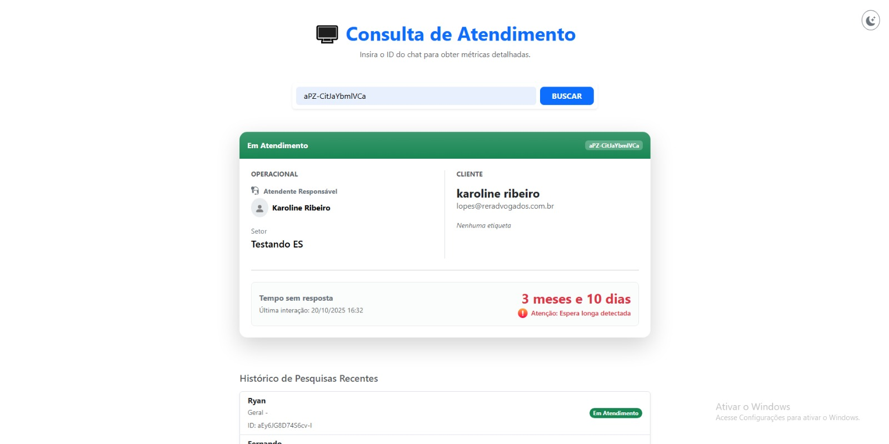
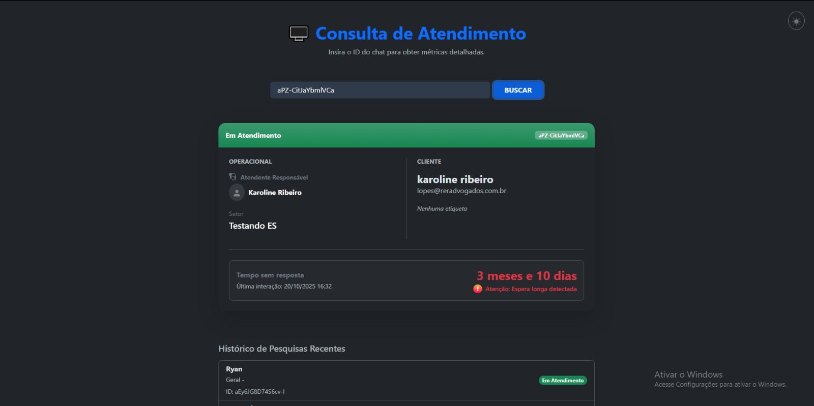
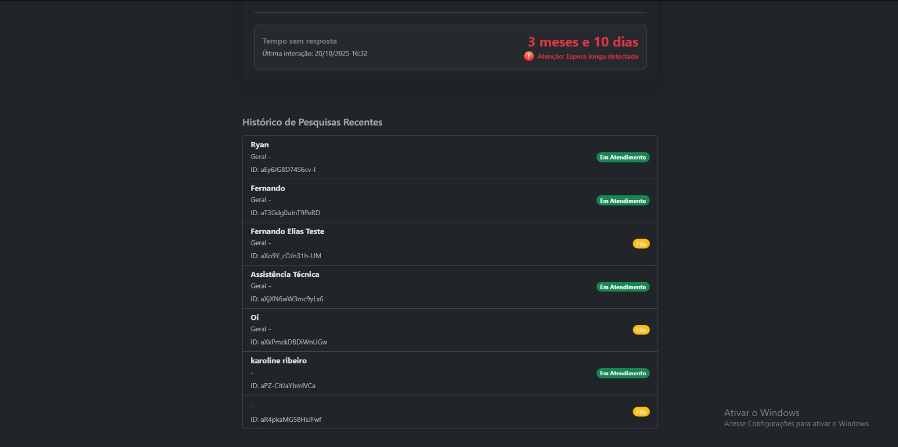

#  RevOps Challenge 

Aplicação desenvolvida para análise detalhada de atendimentos via chat, fornecendo métricas de SLA, identificação de atendentes e histórico de consultas.

---

### Modificações e Melhorias Implementadas

Abaixo, detalho as decisões técnicas e funcionalidades adicionadas para elevar o padrão da aplicação:

#### 1. Observabilidade e Logs (Best Practices)
* **Tratamento de Erros:** Uso de `_logger.LogError` para capturar falhas de requisição HTTP e exceções, garantindo que falhas críticas sejam registradas adequadamente. Em certos momentos de debug usei `Console.WriteLine` para entender o erro, porém depois substitui pela injeção de dependência do `ILogger` nativo do .NET.

#### 2. Arquitetura e Organização
* **Camada de Serviço:** Para garantir a Separação de Responsabilidades, criei o `ChatService.cs` e a interface `IChatService.cs`, removendo a lógica complexa da `Home.razor`.
* **Injeção de Dependência:** Configuração correta do `HttpClient` e serviços no `Program.cs`.

#### 3. Regras de Negócio e Integração API
* **Cálculo Real de SLA:** Implementação de lógica inteligente para calcular o "Tempo de Espera". O algoritmo filtra mensagens de sistema (notas internas, transferências) para considerar apenas interações reais.
* **Enriquecimento de Dados:** Busca de E-mail do Contato (`/v1/contacts/{id}`) e identificação do Atendente Responsável através da rota de organização (`/v1/organizations/{id}`).
* **Fuso Horário:** Ajuste global para exibição de datas no horário local (UTC-3).

#### 4. Interface de Usuário (UI/UX)
* **Reformulação Visual:** Utilização do Bootstrap 5.3 e recursos modernos do Blazor.
* **Dark Mode:** Implementação de alternância de tema (Claro/Escuro) com persistência via LocalStorage.
* **Componentização:** Criação do componente `<ChatDetailsCard />` para promover reutilização de código e limpeza do layout.
* **Feedback Visual:** Alertas coloridos (Vermelho/Verde) e ícones dinâmicos baseados no cumprimento do SLA.

#### 5. Persistência e Correções
* **Histórico de Consultas:** Implementação de listagem dos últimos chats pesquisados, consumindo dados do SQLite.
* **Bug Fix:** Correção do erro de duplicidade ao pesquisar o mesmo chat múltiplas vezes.
* **Configuração:** Correção do erro "Not Implemented" via configuração adequada no `Program.cs`.

---

### 📸 Screenshots

| Modo Claro | Modo Escuro |
|:---:|:---:|
|  |  |

**Detalhes do Chat e Histórico:**



#### Melhorias Futuras (Roadmap)
* **Testes Unitários: Implementar xUnit para testar a lógica de cálculo de SLA no ChatService.
* **Edição de Contato: Implementar funcionalidade de PUT para atualizar dados do contato diretamente pela interface.
* **Cache: Adicionar IMemoryCache para evitar chamadas repetidas à API para o mesmo chat em curto período de tempo.


---

### ⚙️ Como Rodar o Projeto

**Pré-requisitos:**
* .NET SDK (Versão 8 ou superior recomendada)
* Token de API do Talk configurado no `appsettings.json`.

```bash
# 1. Clone o repositório
git clone [SEU LINK DO GITHUB AQUI]

# 2. Atualize o banco de dados
dotnet ef database update

# 3. Execute a aplicação
dotnet run

